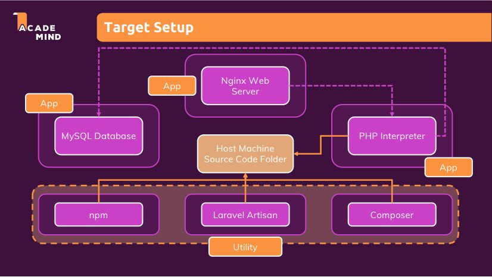

# Overview

This is a demo of setting up a laravel php dev environment using the "util" concept introduced by [Maximilian Schwarzmüller](https://www.udemy.com/user/maximilian-schwarzmuller/)

# Target Setup Components

* Application Containers - App containers that are gonna be running all the time

   * PHP Interpretter
      - Interprets php and generates a response
      - Runs php code
   * Nginx web server
      - Web server which takes the incoming request, takes it to the PHP Interpretter and generates the response
   * MySQL Database 
      - DB for storing data
      - PHP Interpretter communicates with the db

* Utility Containers - Laravel needs 3 kinds of utilities/tools

   * Composer
      * Composer for PHP is what npm is for node
      * Package manager to install 3rd party packages
      * Used to install laravel
      * Then laravel uses this to install dependencies

   * Laravel Artisan
      * A tool for laravel

   * npm
      - laravel uses npm for some of its front end logic  